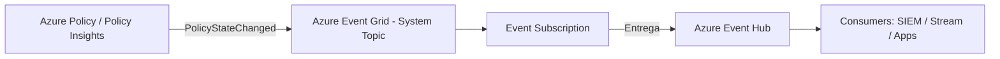
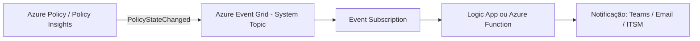

# Azure Policy — Notificação automática de compliance e envio para Event Hub (Event-Driven)

Este README mostra como construir um fluxo **automatizado** para:
- capturar **mudanças de compliance** do Azure Policy (ex.: recurso ficou *NonCompliant*);
- **rotear esses eventos** via Azure Event Grid;
- **entregar no Azure Event Hub** (para SIEM, Stream Analytics, apps, etc.);
- (opcional) **notificar pessoas/sistemas** via Logic App/Function.

> Importante: Azure Policy, por si só, **não envia “alerta de compliance”**. Ela **publica eventos** (state change) que você assina no **Event Grid**.

---

## Visão geral dos fluxos

### Fluxo A (recomendado): Azure Policy → Event Grid → Event Hub


### Fluxo B (notificação): Azure Policy → Event Grid → Logic App/Function → Teams/Email


---

## Pré-requisitos

### Permissões
- Para criar recursos: **Contributor** (ou superior) na subscription/Resource Group.
- Para criar role assignments (RBAC): **Owner** ou **User Access Administrator** no escopo do Event Hub/Namespace.
- Se usar **Management Group** como source, você precisa de permissão equivalente no MG.

### Providers
Garanta que estes Resource Providers estejam registrados:
- `Microsoft.PolicyInsights`
- `Microsoft.EventGrid`
- `Microsoft.EventHub`

### Azure CLI
O tutorial oficial de referência usa CLI e indica versão mínima; se estiver usando CLI antiga, atualize.

---

## Fluxo A — Passo a passo (Portal)

### 1) Criar Event Hubs (destino)
1. Portal → **Event Hubs** → **Create**
2. Crie um **Event Hubs Namespace**
3. Dentro do namespace → **Event Hubs** → **+ Event Hub**
4. (Recomendado) crie/defina **Consumer Group** para seu consumidor (SIEM/app).

### 2) Criar o System Topic do Event Grid (fonte: Azure Policy)
1. Portal → **Event Grid System Topics** → **Create**
2. **Topic type**: Azure Policy state changes (internamente é o tipo `Microsoft.PolicyInsights.PolicyStates`)
3. **Source**:
   - **Subscription** (mais comum) ou **Management Group** (centralizado)
4. Selecione Resource Group + Nome e crie.

### 3) Criar Event Subscription para o Event Hub
1. Abra o **System Topic**
2. **+ Event Subscription**
3. **Event types**: selecione (no mínimo)
   - `Microsoft.PolicyInsights.PolicyStateChanged`
   - (opcional) `...PolicyStateCreated` e `...PolicyStateDeleted`
4. **Endpoint type**: **Event Hub**
5. Selecione o Event Hub de destino e finalize.

### 4) (Recomendado) Segurança de entrega: Managed Identity + RBAC
Para evitar chaves/SAS e usar Entra ID:

1. Habilite **System-assigned Managed Identity** no recurso do Event Grid (quando aplicável no seu cenário).
2. No **Event Hub (ou Namespace)** → **Access Control (IAM)** → **Add role assignment**
3. Atribua o papel:
   - **Azure Event Hubs Data Sender**
4. Para o membro: a **Managed Identity** do Event Grid (system topic / event subscription, conforme sua tela do Portal).

> Sem essa permissão, é comum ver falha de entrega com erro de autorização (401/403) na entrega para Event Hub.

### 5) (Opcional) Filtrar só NonCompliant (reduz ruído e custo)
Na Event Subscription → **Advanced Filters**, aplique condições em campos do evento (ex.: `data.complianceState`).

Dica: primeiro rode sem filtros, capture um evento real, e só depois refine os filtros com base no payload.

### 6) Validar
- Verifique métricas do Event Hub: **Incoming Messages**
- Conecte um consumer (ex.: app de teste, Stream Analytics, SIEM) e confirme o recebimento.

---

## Fluxo A — Passo a passo (CLI) completo

> Este passo a passo é baseado no tutorial oficial de “route policy state change events” e adapta o destino para Event Hub.

### 0) Variáveis
```bash
RG="rg-policy-events"
LOC="eastus"
EHNS="ehns-polcompliance-001"
EH="eh-polcompliance"

SUBID="$(az account show --query id -o tsv)"
```

### 1) Providers + Resource Group
```bash
az provider register --namespace Microsoft.PolicyInsights
az provider register --namespace Microsoft.EventGrid
az provider register --namespace Microsoft.EventHub

az group create -n "$RG" -l "$LOC"
```

### 2) Event Hubs (namespace + hub)
```bash
az eventhubs namespace create -g "$RG" -n "$EHNS" -l "$LOC"
az eventhubs eventhub create -g "$RG" --namespace-name "$EHNS" -n "$EH"

HUBID="$(az eventhubs eventhub show -g "$RG" --namespace-name "$EHNS" -n "$EH" --query id -o tsv)"
```

### 3) System Topic (Azure Policy → Event Grid)
> Observação: o tutorial oficial usa `--location global` para subscription e management group como source.
```bash
az eventgrid system-topic create \
  --name "PolicyStateChanges" \
  --location global \
  --topic-type Microsoft.PolicyInsights.PolicyStates \
  --source "/subscriptions/$SUBID" \
  --resource-group "$RG"
```

### 4) Event Subscription (Event Grid → Event Hub)
```bash
az eventgrid system-topic event-subscription create \
  --name "to-eventhub" \
  --resource-group "$RG" \
  --system-topic-name "PolicyStateChanges" \
  --endpoint-type eventhub \
  --endpoint "$HUBID" \
  --included-event-types Microsoft.PolicyInsights.PolicyStateChanged
```

### 5) (Opcional) Forçar reavaliação de policy (scan)
```bash
az policy state trigger-scan
```

---

## Fluxo B — Notificação (Portal) com Logic App / Function

### Opção 1) Logic App (low-code)
1. Crie uma **Logic App** (Consumption ou Standard).
2. No System Topic (ou no Event Grid), crie uma **Event Subscription** com endpoint do tipo:
   - **Logic Apps** (ou Webhook conforme o designer).
3. No workflow:
   - Parseie o JSON do evento
   - Filtre `data.complianceState == "NonCompliant"`
   - Envie para Teams/Email/ITSM

### Opção 2) Azure Function (mais controle)
1. Crie Function App
2. Crie uma função com trigger de Event Grid (EventGridTrigger)
3. Assine os eventos do System Topic para essa Function
4. No código, filtre e notifique

---

## Troubleshooting (os erros mais comuns em Fluxo A/B)

### 1) “Falha ao criar System Topic / Event Subscription”
Causas típicas:
- falta de permissão `Microsoft.EventGrid/eventSubscriptions/Write` (custom roles ou RBAC insuficiente)
- provider `Microsoft.EventGrid` não registrado
- tentar criar no escopo errado (subscription vs management group) sem permissão

Ações:
- confirme RBAC (Contributor/Owner) no escopo correto
- registre providers
- se usar MG, confirme a sintaxe do `--source` no tutorial oficial
---
### 2) Evento não chega no Event Hub (entrega falhando)
Causas típicas:
- Event Grid não tem autorização para enviar ao Event Hub (RBAC ausente)
- Event Hub/Namespace com políticas/locks, rede restrita, private endpoints sem rota do serviço

Ações:
- garanta role **Azure Event Hubs Data Sender** para a identidade que entrega
- verifique configurações de rede do Event Hub (firewall/private endpoints)
- teste sem filtros primeiro
---
### 3) “Não vejo eventos”
Causas típicas:
- ainda não houve mudança de estado (não gerou evento)
- avaliação de policy ainda não ocorreu (pode levar minutos)
- filtro avançado “escondeu” tudo

Ações:
- rode `az policy state trigger-scan`
- remova filtros avançados e valide o payload bruto primeiro

---

## Artigos

- Azure Policy: Reagir a eventos de alteração de estado (Event Grid): https://learn.microsoft.com/pt-br/azure/governance/policy/concepts/event-overview
- Tutorial (CLI): Rotear eventos de alteração de estado da política: https://learn.microsoft.com/pt-br/azure/governance/policy/tutorials/route-state-change-events
- Azure Policy como origem do Event Grid + schema de eventos: https://learn.microsoft.com/pt-br/azure/event-grid/event-schema-policy
- Azure CLI: az eventgrid system-topic: https://learn.microsoft.com/pt-br/cli/azure/eventgrid/system-topic?view=azure-cli-latest
- Azure CLI: az eventgrid system-topic event-subscription: https://learn.microsoft.com/en-us/cli/azure/eventgrid/system-topic/event-subscription?view=azure-cli-latest
- Azure CLI: az policy state trigger-scan: https://learn.microsoft.com/en-us/cli/azure/policy/state?view=azure-cli-latest#az-policy-state-trigger-scan
- RBAC/Event Hubs: built-in roles (Azure Event Hubs Data Sender): https://learn.microsoft.com/azure/role-based-access-control/built-in-roles
- Autorizar acesso ao Event Hubs com Microsoft Entra ID: https://learn.microsoft.com/azure/event-hubs/authorize-access-azure-active-directory
- Diagnostic settings (Activity Log → Event Hub): https://learn.microsoft.com/azure/azure-monitor/essentials/diagnostic-settings
- Activity Log (export destinations): https://learn.microsoft.com/azure/azure-monitor/essentials/activity-log
- Log Analytics workspace data export (para Event Hub): https://learn.microsoft.com/azure/azure-monitor/logs/logs-data-export
