# Criando Snapshots de VMs no Azure com TAGs

**Postado em:** 10/08/2025  
**Atualizado:** 10/08/2025  
**Por:** Ruiz Online Solutions  
**Tempo de leitura:** 4 min

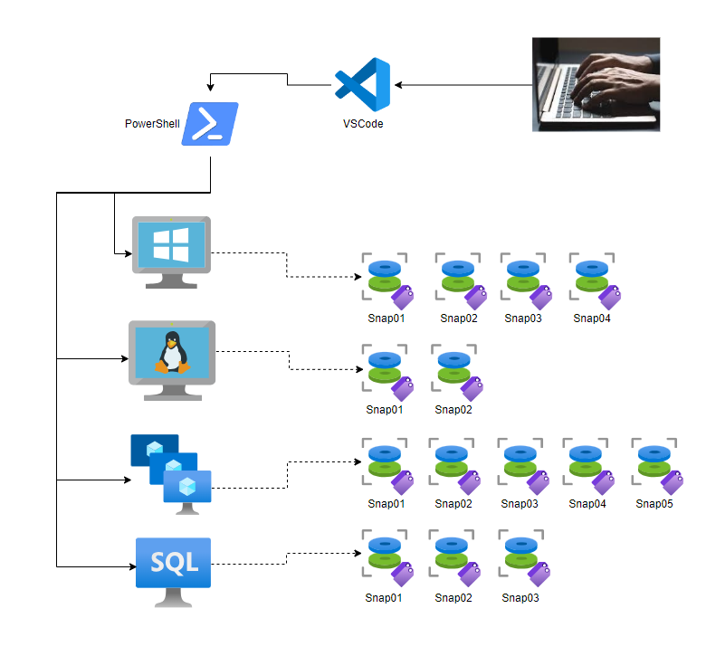

## Introdução

Fala pessoal! Atualmente, vemos empresas de todos os tamanhos migrando seus workloads para a nuvem no modelo lift and shift — basicamente, mover como está para o Azure, mantendo o funcionamento igual ao ambiente on-premises. Essa abordagem é muito comum quando há dependência de serviços ou aplicações legadas que não podem ser facilmente modernizadas.

Nesse cenário, VMs (IaaS) ainda são peça-chave para muitos negócios, e aqui vem a pegadinha: ao optar por IaaS, a responsabilidade pela segurança do sistema operacional é **sua**. Isso significa manter o ambiente atualizado com todos os patches de segurança aplicados e testados, sem desculpas.

O problema é que, às vezes, uma atualização pode quebrar algo crítico. Por isso, antes de aplicar qualquer update em produção, backup é obrigatório. Uma das formas mais rápidas e práticas de garantir isso é criando um snapshot dos discos da VM.

Agora pense em um ambiente com 50+ VMs, cada uma com pelo menos dois discos anexados. Fazer snapshot manualmente, VM por VM, é receita para perder horas do seu dia — e talvez até a paciência. É aqui que entra a automação inteligente com TAGs, reduzindo o trabalho repetitivo e garantindo consistência.

**Neste artigo, ensinarei como efetuar snapshots de forma automatizada de todos os discos das VMs (Virtual Machines) que foram inseridas em arquivo .CSV, incluindo TAGs definidas através de um script pronto.**

---

## Pré-requisitos

- Possuir permissão de no mínimo Contributor na Subscription
- Instalar o [PowerShell (mínimo 7.4.2)](https://github.com/powershell/powershell/releases)
- Instalar o módulo de [Az](https://learn.microsoft.com/en-us/powershell/azure/install-azps-windows?view=azps-14.3.0&viewFallbackFrom=azps-13.4.0&tabs=powershell&pivots=windows-psgallery)
- Instalar o módulo [ImportExcel](https://www.powershellgallery.com/packages/ImportExcel/7.8.9)

---

## Mão na massa!

### Passo 1

> **Para iniciarmos, precisamos baixar os arquivos necessários para a criação dos snapshots e configurar o arquivo 'snapshot.ps1' com as TAGs que serão aplicadas.**

**Faça o Download do script [snapshot.ps1](./assets/snapshot.ps1).**

**Faça o Download do arquivo [snapshot.csv](./assets/snapshot.csv).**

**Ou se preferir, faça o Download do arquivo [snapshot.zip](./assets/snapshot.psd1) que contem os arquivos necessários.**

1 - Crie uma pasta chamada *Temp* na raiz da unidade C:\ e extraia todos os arquivos neste local:

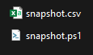

2 - O arquivo '**s[snapshot.ps1](./assets/snapshot.ps1)**' encontra-se devidamente preenchido, contendo as informações necessárias para a criação das TAGs como:

- Chamado = "Ticket"
- Solicitante = "Solicitante"
- "Excluir em" = "xx-xx-xxxx"

> **Obs 01** - Os nomes foram sugeridos mediante as experiências anteriores que necessitavam dessas informações, mas podem ser facilmente alterados por um de sua preferência.

> **Obs 02** - O campo VALOR (Exemplo: "Ticket") precisa conter OBRIGATORIAMENTE aspas duplas.

3 - Para editarmos o arquivo 'snapshot.ps1', basta clicarmos com o botão direito e selecionar editar/edit:

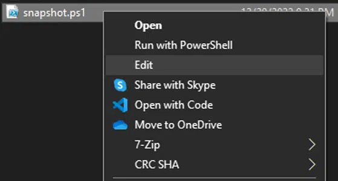

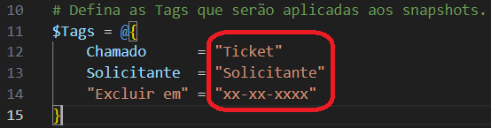

---

### Passo 2

> **Após ajustar o arquivo 'snapshot.ps1', agora precisamos incluir quais VMs terão os snapshots realizados e em qual subscription (assinatura) elas pertencem.**

1 - Abra o arquivo '**snapshot.csv**' e substitua as colunas **A** e **B** a partir da linha 2. Na **coluna A** ficam as VMs que terão os snapshots realizados e na **coluna B** ficará o ID da Subscription (assinatura) onde estão alocadas as VMs:

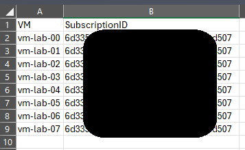

> Confira atentamente a coluna 'B' onde foi incluído o ID da sua Subscription (Assinatura) e em seguida salve o arquivo.

---

### Passo 3

Nesse momento todos os recursos foram devidamente coletados e estão prontos para uso. Execute o PowerShell com privilégios de **Administrador**.

1 - Navegue até a pasta **'C:\Temp'** e execute o snapshot.ps1 incluindo os parâmetros **-TenantId "xxxxxxxx-xxxx-xxxx-xxxx-xxxxxxxxxxxx" -ResourceGroupName "nomedoRG"**.

```powershell
.\snapshot.ps1 -TenantId "xxxxxxxx-xxxx-xxxx-xxxx-xxxxxxxxxxxx" -ResourceGroupName "nomedoRG"
```

> No exemplo abaixo salvaremos os snapshots no Resource Group chamado '**snapshotstemporarios**':

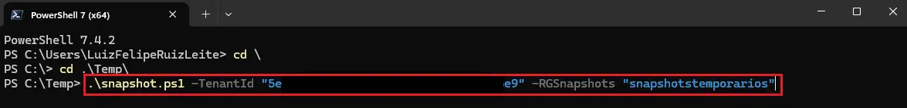

2 - Em seguida irá solicitar quais discos você necessita realizar os snapshots:

- OS = Somente os discos do Sistema Operacional;
- Data = Somente os discos de Dados;
- All = Todos os discos.

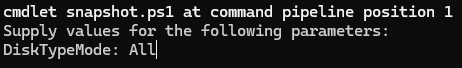

3 - Após selecionada a opção desejada, irá aparecer um '*pop-up*' solicitando uma conta que tenha acesso ao Tenant indicado anteriormente:

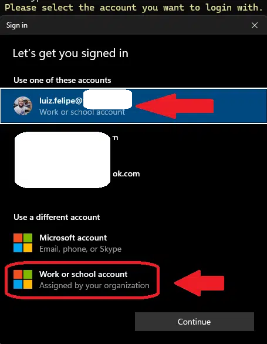

> Caso ainda não tenha uma conta previamente conectada, selecione a opção "*Work or School Account*" ou "*Conta de Trabalho ou Escola*", como a imagem acima, e em seguida inclua seu login e senha para acesso ao tenant.

4 - Nesse momento irá aparecer um breve resumo informando quais VMs foram selecionadas na planilha CSV e as TAGs que serão incluídas na criação desses snapshots:

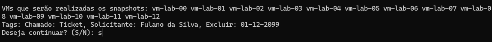

Basta incluir um **S** para continuar e aguardar a execução do script completo. Aparecerão as informações relevantes sobre cada snapshot realizado automaticamente:

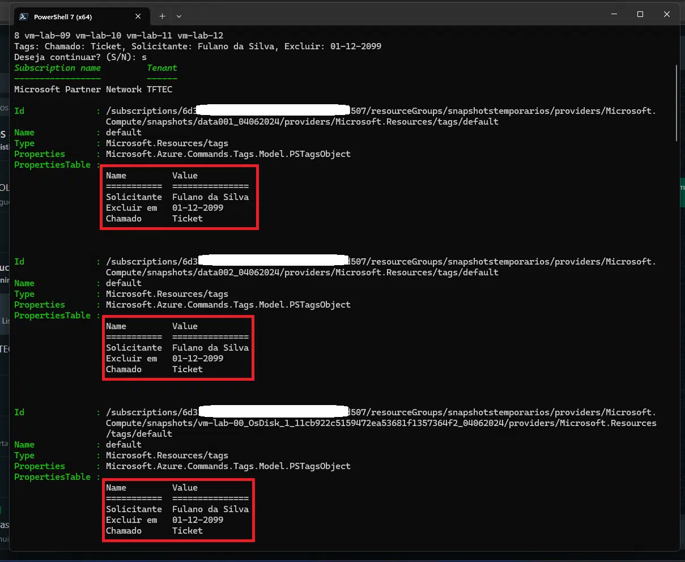

Vamos olhar agora no Portal do Azure para validar se todos os snapshots (no caso eu selecionei todos os discos) foram realizados com sucesso:

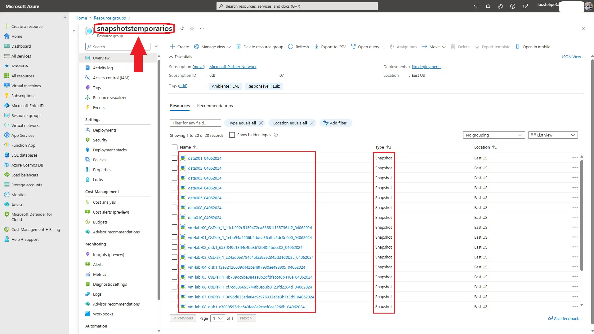

---

Adicionalmente foi criado um arquivo de **LOG** contendo as informações dos discos que tiveram os snapshots realizados e armazenado na mesma pasta onde estão localizados os arquivos:

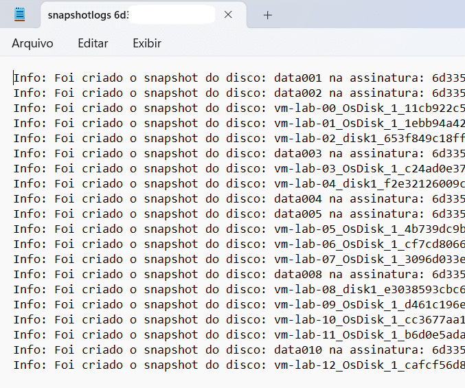

---

## Checklist

- [x] Passo 1 - Fazer o download dos arquivos necessários e inserir as informações para o snapshot.ps1
- [x] Passo 2 - Inserir as informações das VMs e a Subscription à qual elas pertencem no arquivo snapshot.csv
- [x] Passo 3 - Executar o arquivo snapshot.ps1 com os parâmetros TenantId e o ResourceGroupName

---

## Artigos de Referência

| Nome | Link |
|------|------|
| Instalar o PowerShell | https://github.com/powershell/powershell/releases |
| Instalar o módulo Az | https://learn.microsoft.com/pt-br/powershell/azure/install-azps-windows?view=azps-12.0.0&tabs=powershell&pivots=windows-psgallery |
| Módulo de PowerShell ImportExcel | https://github.com/dfinke/ImportExcel |

---

## The End!

Este é o fim de mais um artigo em nosso blog! Viram como com alguns passos simples descomplicamos todo o trabalho manual que muitos analistas de TI enfrentam em seu dia a dia? Espero que tenham curtido este artigo… Até a próxima!

---

**Tags:** azure, tag, environment, snapshot, resources

**Licença:** Esta postagem está licenciada sob [CC BY 4.0](https://creativecommons.org/licenses/by/4.0/) pelo autor.

**Fonte:** [Blog Ruiz Online Solutions](https://blog.ruizonlinesolutions.com/posts/criando-snapshot-de-vms-atraves-de-tags/)